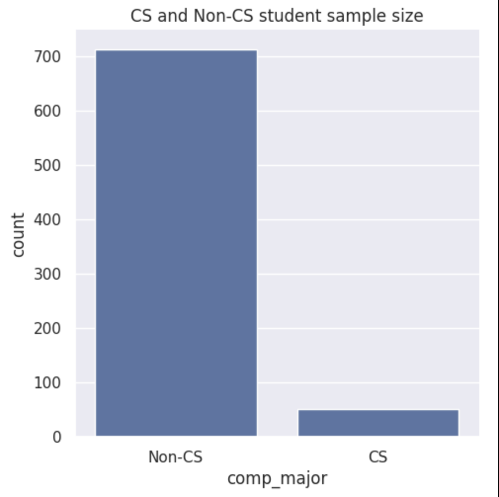
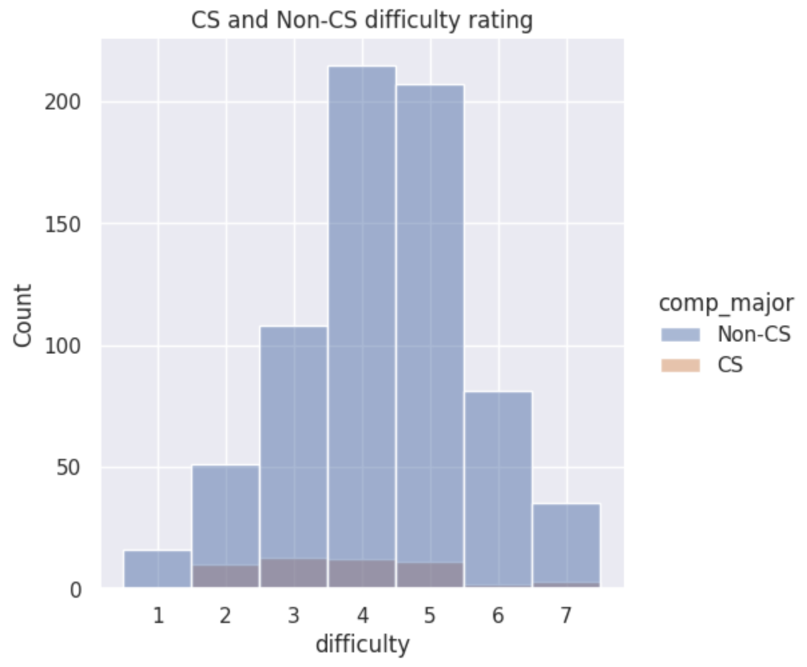
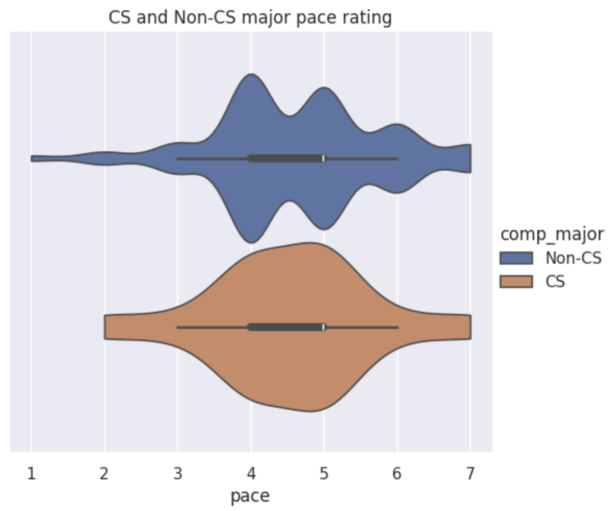
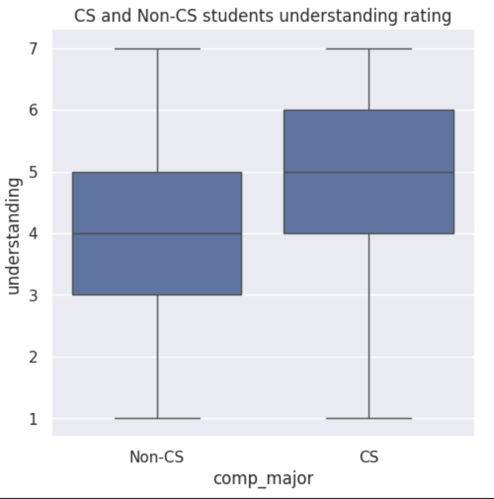

---
# Do not edit the text between these lines!
layout: default
---

# Project Summary

## Project Goal

This project analyzes survey data comparing CS and Non-CS students in terms of perceived difficulty, pace, and understanding of COMP110. The primary goal of the analysis is to evaluate whether introducing a targeted support session for non-CS majors could improve their learning experience. This idea is motivated by the possibility that students without prior computer science background may experience greater difficulty, slower perceived pace, or lower understanding compared to CS majors.

The investigation focuses on comparing CS and Non-CS student responses across three key Likert-scale variables: difficulty, pace, and understanding. These variables are selected because they directly reflect students' learning experiences and engagement with the course content.

## Analysis Summary

To conduct the analysis, the two survey files are first combined. Then the dataset is cleaned to remove incomplete responses and grouped by major type (CS and Non-CS). Personal helper function is created to implement the cleaning steps. The sample size is also checked before visualization to verify completeness of data and sample size balance.

## Visualization

During the visualization step, Seaborn was used to generate graphs, including distribution plots and categorical plots, to identify patterns, differences, and variability between the two student groups.

### Distribution of CS and Non-CS students

A bar graph is used to visualize the distribution of CS major and Non-CS major students in the dataset. 

This bar chart indicates a substantial sample size imbalance between the two groups. The Non-CS group represents the vast majority of responses (713 students), while the CS group is much smaller (51 students). This imbalance is important to keep in mind when interpreting the remaining visualizations, as patterns in the Non-CS group will dominate the overall dataset.

### Difficulty

A histogram is used to compare difficulty ratings between CS and Non-CS students. Since difficulty is a numeric Likert-scale variable, this visualization shows how responses are distributed across the full range of values and allows us to compare the frequency and spread of ratings between the two groups. 

The difficulty ratings for both CS and Non-CS students are centered around moderate values, with most responses clustering between 4 and 5 on the Likert scale. This suggests that, overall, students perceive the course as neither too easy nor excessively difficult. However, Non-CS students show a wider spread in their responses compared to CS students, particularly with more ratings at the higher end of the scale. This difference suggests that Non-CS students experience more variability in how difficult the course feels, even if the overall central tendency is similar between the groups.

### Pace

A violin plot is used to compare the average pace rating between CS and Non-CS students. This format highlights the density and spread of perceived course pace across the two groups, allowing for an observation of where the majority of ratings are concentrated on the Likert scale.

The pace distribution shows that both CS and Non-CS students generally rate the course pace around the moderate level (approximately 4–5). However, CS students tend to report a more consistent experience, with responses tightly clustered around this range. Non-CS students, on the other hand, display a broader distribution, indicating more variability in how they perceive the speed of instruction. Some Non-CS students find the pace relatively fast, while others find it slower, suggesting less uniformity in their experience.

### Understanding

A box plot is created to compare the understanding rating between CS and Non-CS students. This visualization is useful because it shows the median and spread of the responses, allowing us to evaluate differences in central tendency and variability between the two groups without assuming a specific distribution shape.

The box plot reveals a clear difference in perceived understanding between CS and Non-CS students. CS students report a higher median understanding score, indicating greater overall confidence in the course material. Additionally, the interquartile range for CS students is shifted higher compared to Non-CS students, suggesting stronger comprehension across the middle portion of the distribution. Non-CS students show a wider spread and lower central tendency, with many responses clustered at lower understanding levels. This indicates a noticeable gap in perceived comprehension between the two groups.

## Conclusion

The analysis demonstrates a consistent pattern across all visualizations. While CS major and Non-CS major students report similar average perceptions of course difficulty and pace, the distribution of responses reveals meaningful differences in how the course is experienced. Non-CS major students exhibit substantially greater variability in difficulty and pace ratings and report a noticeably lower level of understanding compared to CS major students. In particular, the median understanding scores for CS students align with the upper quartile of Non-CS students, indicating that many Non-CS students feel less confident in their comprehension of the material.

These findings support the idea that the course structure, while effective for students with a computer science intended major, does not produce an equally consistent learning experience for students without prior interest in computer science.

### Recommendation

Although differences are observed between CS and Non-CS students, the magnitude of these differences is not large enough to justify a major structural redesign of the course or separate sessions. However, the results suggest that targeted, low-cost support mechanisms could still improve consistency in student experience.

Rather than creating separate course sections, a more appropriate response would be to introduce lightweight support resources, such as optional review materials or early-stage skill reinforcement for students who are not majoring in CS. This approach addresses observed disparities without significantly changing the overall course design or increasing instructional burden.

### Extensions and Refinements

Further analysis could examine whether these perception gaps change over time (early vs. late semester responses), whether a declared major better predicts these outcomes, and whether specific assignments or topics correlate with spikes in diffculty ratings. Collecting longitudinal data or linking responses to performance outcomes would provide stronger evidence for targeted interventions.

### Costs and Trade-offs

Adding supplemental resources requires instructor time, course staff coordination, and potentially increased workload for students who choose to participate. There is also a risk of stigmatizing Non-CS students if support is not framed as broadly beneficial. However, these trade-offs are outweighed by the potential improvement in learning equity and student confidence without altering the core pacing that benefits CS students.